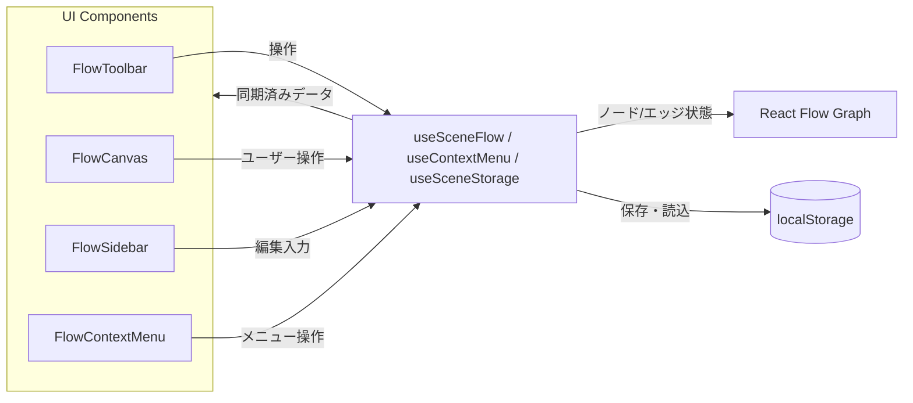

# Novel Node Editor アーキテクチャ概要

本ドキュメントでは Novel Node Editor の全体構成と主要コンポーネントの責務、ビルド環境についてまとめます。

## 全体構成

アプリケーションは Vite + React で構築された SPA であり、ノードベースのシーン編集 UI を提供します。主要なデータフローは下図のように、`useSceneFlow` フックを中心に React Flow コンポーネントと UI 部品が相互作用する構造です。



## ディレクトリ構成

```
src/
├─ App.tsx              # 画面全体を組み立てるルートコンポーネント
├─ main.tsx             # React エントリポイント
├─ index.css            # Tailwind ベースのスタイル定義
├─ components/          # 画面部品 (Canvas / Sidebar / Toolbar など)
├─ hooks/               # 状態管理用のカスタムフック群
├─ types/               # 型定義 (Scene ノード型など)
└─ utils/               # シーンデータ整形ロジック
```

### 主要モジュールと責務

| モジュール | 位置 | 主な責務 |
| --- | --- | --- |
| `App.tsx` | `src/App.tsx` | React Flow プロバイダ配下でエディタ画面を構築し、カスタムフックから提供される状態とハンドラを各コンポーネントへ配線する。 |
| `FlowCanvas` | `src/components/FlowCanvas.tsx` | React Flow を描画し、ノード・エッジ操作イベントを `useSceneFlow` に委譲する。ミニマップやコントロール UI も提供。 |
| `FlowSidebar` | `src/components/FlowSidebar.tsx` | 選択中ノードのタイトル・概要編集フォームを表示し、入力値変更を `useSceneFlow` 経由で即時反映させる。 |
| `SceneNode` | `src/components/SceneNode.tsx` | 各シーンノードの見た目とインライン編集 UI を担当。選択状態や編集モードに応じたスタイルを切り替える。 |
| `FlowToolbar` | `src/components/FlowToolbar.tsx` | 新規作成、保存、読み込み、ノード追加といったコマンドボタンを提供。 |
| `ContextMenu` | `src/components/ContextMenu.tsx` | ノード／キャンバスでのコンテキストメニューを表示し、削除・ノード追加などの操作をトリガーする。 |
| `useSceneFlow` | `src/hooks/useSceneFlow.ts` | React Flow のノード・エッジ状態を管理し、追加・削除・接続・編集ハンドラを実装する中核フック。ローカル UI 状態（選択、編集中ノード）もここで管理。 |
| `useSceneStorage` | `src/hooks/useSceneStorage.ts` | `localStorage` へのスナップショット保存・読み込み、新規リセット処理を担当。 |
| `useContextMenu` | `src/hooks/useContextMenu.ts` | ノード／キャンバス用のコンテキストメニュー状態と表示位置を制御する。 |
| `sceneData` ユーティリティ | `src/utils/sceneData.ts` | React Flow ノードデータの同期・正規化、概要表示テキスト整形を提供。 |
| `Scene` 型定義 | `src/types/scene.ts` | ノードデータ構造 (`SceneNodeData`) と `SceneNode` 型の TypeScript 定義。 |

## 状態とデータフロー

- ノードとエッジの配列は `useSceneFlow` 内で `useState` により管理され、React Flow の `onNodesChange` / `onEdgesChange` コールバックを通じて更新されます。
- サイドバーやノードのインライン編集で入力されたタイトル・概要は、選択中ノード ID を参照しながら `useSceneFlow` が即時に同期します。
- `useSceneStorage` が `localStorage` に JSON 形式でスナップショットを保存し、読み込み時には `sceneData` ユーティリティで正規化してから `useSceneFlow` に適用します。
- コンテキストメニューは `useContextMenu` が DOM 座標を React Flow 座標に変換しながら開閉を制御します。

## ビルド設定と開発フロー

| 設定ファイル | 主な役割 |
| --- | --- |
| `vite.config.ts` | Vite のエントリ設定。React プラグイン (`@vitejs/plugin-react`) を読み込み、高速な HMR と TSX サポートを提供します。 |
| `tailwind.config.js` | Tailwind CSS の `content` 対象とダークモード設定 (`class`) を定義。`src` 配下と `index.html` がスキャン対象です。 |
| `postcss.config.js` | PostCSS パイプラインに `tailwindcss` と `autoprefixer` を適用。 |
| `tsconfig.json` / `tsconfig.node.json` | TypeScript コンパイル設定。ビルド時は `tsc -b` で型検査を実施します。 |

### 主要依存ライブラリ

- **React 18**: UI 構築のベース。
- **React Flow**: ノードベースのグラフ描画と編集機能を提供。
- **Tailwind CSS**: ユーティリティベースのスタイリングを実現し、`index.css` 内でカスタムクラスを構築。
- **Vite**: 開発サーバーとビルドツール。React プラグインによって JSX/TSX トランスフォームをサポート。
- **TypeScript**: 型安全なコンポーネント開発を支援。

## 補足: スタイルとテーマ

- `src/index.css` で Tailwind の `@apply` を利用し、ノードの状態（通常／選択／編集中）に応じたクラスを定義しています。
- ルート要素に `dark` クラスを付与し、常時ダークテーマを適用しています。

## 開発・ビルド手順

1. 依存関係のインストール: `npm install`
2. 開発サーバー起動: `npm run dev`（Vite 開発サーバー）
3. 本番ビルド: `npm run build`（TypeScript 型チェック + Vite ビルド）
4. ビルドプレビュー: `npm run preview`

以上がプロジェクトのアーキテクチャ概要です。
